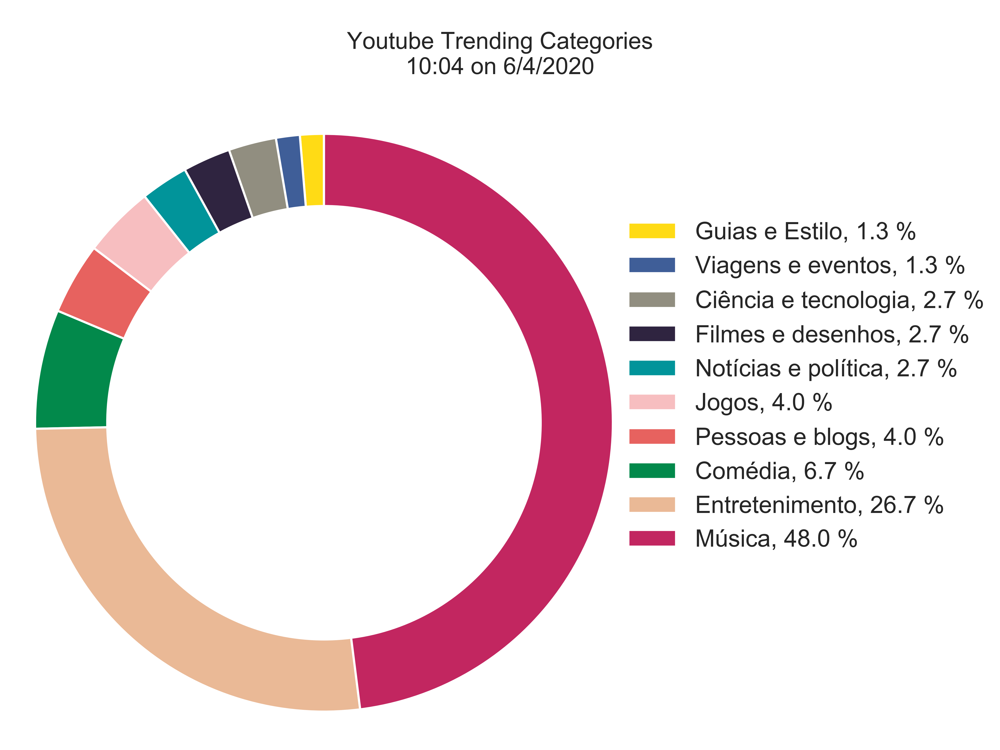

# Youtube Trending Scraper
This is a program that checks all videos on trendings and gets it's categories and returns a pie chart of it.

## What have I learned with the project?
### Web driver
Using `selenium` package, I was able to perform web scrap on [Youtube Trendings](https://www.youtube.com/feed/trending) with a Chrome web driver (you can find it on `tools` file)
### Pie chart
learned to create highly customized pie charts in `matplotlib` with the help of `seaborn`

## Setting up
In order to run, you will need some libraries
* Selenium
* Pandas
* Matplotlib
* Seaborn
* Datetime

In your `cmd`, you can use `pip install` to get the packages
```
> pip install selenium pandas matplotlib seaborn datetime
```
Now you should be able to run `scraper.py` properly. It takes about 8 minutes to be done and return a chart saved on scraper's repository
